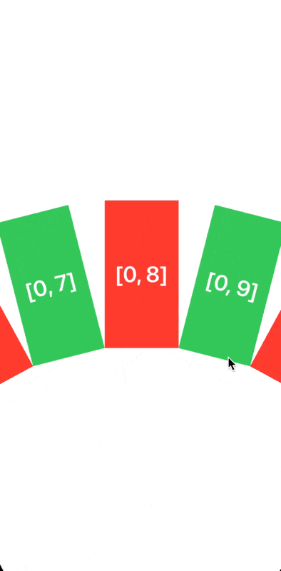

# Демо проект, в котором реализуется кастомный UICollectionViewLayout

## Что находится в проекте

- пример работы с `UICompositionalLayout`
- пример наследования от `UICollectionViewFlowLayout` и реализации 3D Cube перехода
- пример наследования от `UICollectionViewLayout` и реализация полукруглого layout-а

## Как запустить

1. Открыть xcodeproj
2. В файле `SceneDelegate` выставить нужный контроллер
3. Запустить

## Ресурсы

#### Интересные репозитории
- https://github.com/KelvinJin/AnimatedCollectionViewLayout
- https://github.com/amirdew/CollectionViewPagingLayout
- https://github.com/filletofish/CardsLayout
- https://github.com/awdigital/AWCollectionViewSlidingDoors

#### Гайды
- https://www.vadimbulavin.com/sticky-grid-collection-view/
- https://habr.com/ru/companies/dododev/articles/452876/
- https://www.objc.io/issues/3-views/collection-view-layouts/

#### Доклады
- https://www.youtube.com/watch?v=Q2NLgfYN7Pg

#### Анимации
- https://www.objc.io/issues/5-ios7/collection-views-and-uidynamics/
- https://www.objc.io/issues/12-animations/collectionview-animations/
- https://github.com/roberthein/BouncyLayout

#### Оф. документация
- WWDC 2018 tour to UICollectionView [Download HD video](https://developer.apple.com/devcenter/download.action?path=/videos/wwdc_2012__hd/session_219__advanced_collection_views_and_building_custom_layouts.mov)
- [Customizing Collection View Layouts](https://developer.apple.com/documentation/uikit/views_and_controls/collection_views/layouts/customizing_collection_view_layouts)
- [Using the Flow Layout](https://developer.apple.com/library/archive/documentation/WindowsViews/Conceptual/CollectionViewPGforIOS/UsingtheFlowLayout/UsingtheFlowLayout.html#//apple_ref/doc/uid/TP40012334-CH3-SW1)